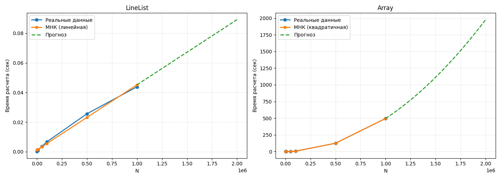

# Сравнение производительности: LineList vs Array

## Данные

В репозитории представлены два файла с результатами измерения времени выполнения операций для разных структур данных C++:

- **`linelist_data.csv`** – реализация на основе линейного списка (`LineList`)
- **`array_data.csv`** – реализация на основе массива (Array)

### Результаты замеров

| N       | LineList (сек) | Array (сек) |
|---------|----------------|-------------|
| 1000    | 0.000168       | 0.003466    |
| 5000    | 0.000569       | 0.022395    |
| 10000   | 0.001017       | 0.070302    |
| 50000   | 0.00359        | 1.32958     |
| 100000  | 0.006736       | 5.16601     |
| 500000  | 0.025631       | 124.437     |
| 1000000 | 0.043825       | 495.48      |

### Анализ различий

**LineList (линейный список):**
- Время растёт практически **линейно** с увеличением N
- Эффективен для вставок и удалений в середине
- При N = 1 000 000 показывает время **0.044 сек**

**Array (массив):**
- Время растёт **квадратично** (или быстрее) из-за необходимости сдвигать элементы
- При N = 1 000 000 время достигает **495 сек** (в ~11 000 раз медленнее)
- Неэффективен для частых удалений из середины

## Связь с кодом

В классе `LineList` реализован метод **`makeCircular()`**, который преобразует линейный список в кольцевой (циклический). Этот метод используется для решения **задачи Иосифа Флавия** – задачи, где требуется последовательно удалять элементы из круга.

## График производительности

Ниже представлен график, показывающий реальные данные, аппроксимацию МНК и прогноз до 2 млн элементов для обеих структур данных.

## Вывод

Для задач с частыми удалениями или вставками в середине (например, задача Иосифа Флавия) **линейный список** значительно эффективнее массива. Массив подходит для случайного доступа по индексу, но не для модификации структуры в середине.
