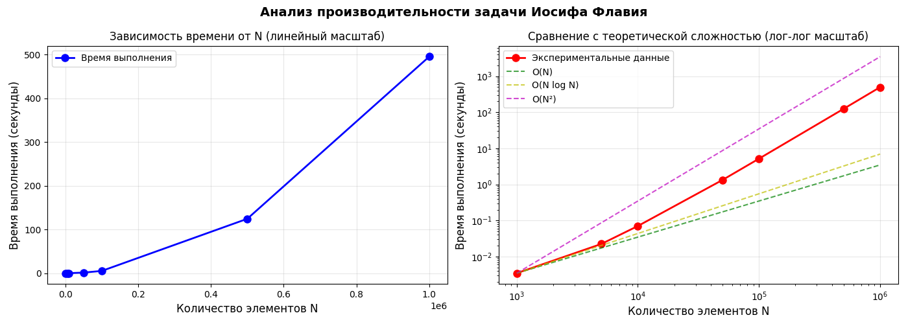

# Анализ производительности задачи Иосифа Флавия

## Результаты тестирования

## Выводы

Временная сложность алгоритма составляет **O(N²)** при более большем объеме даннх.

**Причина:** Это происходит из-за метода remove(), в котором при удалении элемента из массива все последующие элементы сдвигаются, что при N-1 удалениях дает квадратичную сложность.
