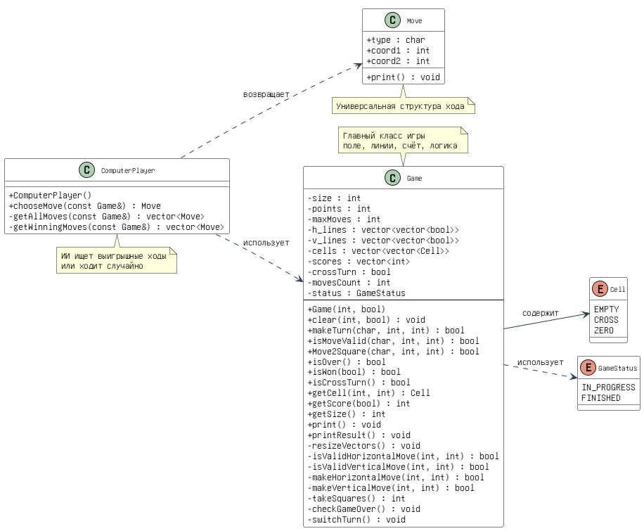
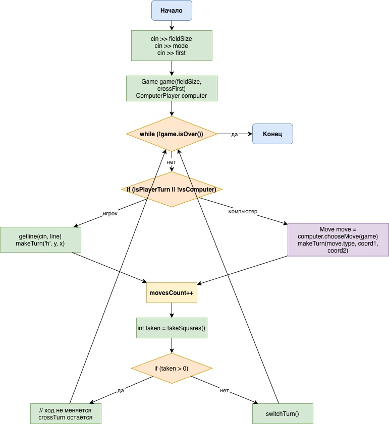

# Игра «Палочки»

Консольная реализация классической игры «Палочки» на C++. Поддерживается игра на двоих или против компьютера.

---

## Модель объектно-ориентированного проектирования



*На диаграмме показаны классы `Game`, `ComputerPlayer`, структура `Move`, перечисления `Cell` и `GameStatus`, а также связи между ними.*

---

## Функциональная схема алгоритма



*Схема отражает ТОЛЬКО ОСНОВНУЮ часть: ввод параметров, инициализацию, игровой цикл, обработку ходов игрока и компьютера, учёт завершённых квадратов и переключение хода.*

---

## Краткое описание методов классов

### Класс `Game`

Основной класс, управляющий состоянием игры, правилами и отрисовкой.

#### Конструктор и очистка

| Метод | Описание |
|-------|----------|
| `Game(int size, bool crossFirst)` | Конструктор, вызывающий `clear()` |
| `clear(int newSize, bool crossFirst)` | Устанавливает размер поля, сбрасывает состояние игры, счёт и перерисовывает векторы |

#### Ходы и проверки

| Метод | Описание |
|-------|----------|
| `makeTurn(char type, int coord1, int coord2)` | Выполняет ход (горизонтальный `h` или вертикальный `v`), увеличивает счётчик, проверяет завершённые квадраты и переключает ход, если не было взятия |
| `isMoveValid(char type, int coord1, int coord2)` | Проверяет, можно ли поставить линию (не выходит за границы и ещё не нарисована) |
| `Move2Square(char type, int coord1, int coord2)` | Проверяет, завершит ли данный ход какой-либо квадрат (используется ИИ для поиска выигрышных ходов) |

#### Состояние игры

| Метод | Описание |
|-------|----------|
| `isOver()` | Возвращает `true`, если игра закончена (сделаны все возможные ходы) |
| `isWon(bool cross)` | Определяет, победили ли крестики (`cross == true`) или нолики |
| `isCrossTurn()` | Возвращает `true`, если сейчас ход крестиков |
| `checkGameOver()` | Внутренний метод, устанавливает статус `FINISHED`, когда `movesCount` достигает `maxMoves` |

#### Геттеры

| Метод | Описание |
|-------|----------|
| `getCell(int row, int col)` | Возвращает состояние клетки (`EMPTY`, `CROSS` или `ZERO`) |
| `getScore(bool cross)` | Возвращает счёт указанного игрока |
| `getSize()` | Возвращает размер поля (количество клеток по стороне) |

#### Отрисовка

| Метод | Описание |
|-------|----------|
| `print()` | Выводит в консоль текущее состояние поля, номера точек, нарисованные линии, занятые клетки, счёт и чей ход |
| `printResult()` | Выводит финальный счёт и объявляет победителя |

#### Приватные вспомогательные методы

| Метод | Описание |
|-------|----------|
| `resizeVectors()` | Изменяет размеры векторов `h_lines`, `v_lines` и `cells` под новый размер поля |
| `isValidHorizontalMove(int y, int x)` | Проверка корректности горизонтального хода |
| `isValidVerticalMove(int x, int y)` | Проверка корректности вертикального хода |
| `makeHorizontalMove(int y, int x)` | Внутренняя установка горизонтальной линии |
| `makeVerticalMove(int x, int y)` | Внутренняя установка вертикальной линии |
| `takeSquares()` | Проверяет все клетки: если у клетки нарисованы все четыре стороны, она присваивается текущему игроку, счёт увеличивается, возвращается количество новых квадратов |
| `switchTurn()` | Меняет текущего игрока (`crossTurn = !crossTurn`) |

---

### Структура `Move`

Хранит информацию об одном ходе.

| Поле/Метод | Описание |
|------------|----------|
| `char type` | `'h'` (горизонтальная линия) или `'v'` (вертикальная линия) |
| `int coord1` | Для `'h'`: y (строка точек), для `'v'`: x (столбец точек) |
| `int coord2` | Для `'h'`: x (столбец линии), для `'v'`: y (строка линии) |
| `print()` | Выводит ход в формате `тип coord1 coord2` |

---

### Класс `ComputerPlayer`

Реализует искусственный интеллект (случайные ходы с приоритетом на завершение квадрата).

#### Публичные методы

| Метод | Описание |
|-------|----------|
| `ComputerPlayer()` | Конструктор, инициализирует генератор случайных чисел |
| `chooseMove(const Game& game)` | Основной метод выбора хода: сначала ищет выигрышные ходы (завершающие квадрат), если есть – выбирает случайный из них, иначе – случайный из всех возможных |

#### Приватные методы

| Метод | Описание |
|-------|----------|
| `getAllMoves(const Game& game)` | Перебирает все горизонтальные и вертикальные линии, проверяет `isMoveValid()` и возвращает вектор допустимых ходов |
| `getWinningMoves(const Game& game)` | Для каждого хода из `getAllMoves()` вызывает `game.Move2Square()` и собирает ходы, завершающие хотя бы один квадрат |

---

### Перечисления

| Перечисление | Значения | Описание |
|--------------|----------|----------|
| `Cell` | `EMPTY`, `CROSS`, `ZERO` | Состояние клетки: пустая, занята крестиком, занята ноликом |
| `GameStatus` | `IN_PROGRESS`, `FINISHED` | Состояние игры: в процессе, завершена |

---

## Сборка и запуск

### Файлы проекта
- `main.cpp`
- `sticks.h`, `sticks.cpp`
- `computer_player.h`, `computer_player.cpp`

### Компиляция и запуск

```bash
g++ main.cpp sticks.cpp computer_player.cpp -o sticks_game
./sticks_game